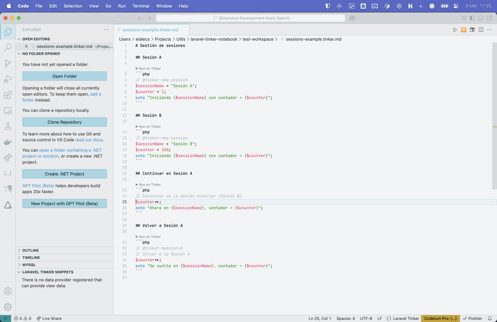

# Laravel Tinker Notebook


A powerful VS Code extension that brings interactive PHP/Laravel code execution directly into your editor. Similar to Jupyter notebooks for Python, Laravel Tinker Notebook allows you to write, document, and execute PHP code within Markdown files, providing immediate feedback without leaving your IDE.

## 🚀 Key Features

- **Interactive Code Execution**: Run PHP/Laravel code directly in your editor with Ctrl+Enter
- **Session Management**: Maintain state between code executions for complex workflows
- **Smart Output Formatting**: Automatic formatting for JSON, arrays, and objects
- **Snippet Library**: Organize and reuse code snippets across projects
- **Process Pooling**: Optimized performance with process reuse and resource management
- **Special Directives**: Control execution behavior with simple directives
- **Export Capabilities**: Share results in multiple formats (JSON, CSV, HTML)

## 📸 Screenshots

### Interactive Code Execution

<!-- SCREENSHOT: Main interface showing code execution -->


### Smart Output Formatting

<!-- SCREENSHOT: Different output formats -->


### Snippet Library

<!-- SCREENSHOT: Snippet library interface -->


## 🎬 See It In Action

<!-- SCREENCAST: Quick demo of basic features -->


## 🔧 Installation

### Prerequisites

- VS Code or VSCodium (version 1.60.0 or higher)
- PHP 7.4+ installed and available in your PATH
- A Laravel project (version 8.0+) with Tinker installed
- Composer installed for dependency management

### Installation Steps

1. Open VS Code
2. Go to Extensions (Ctrl+Shift+X or Cmd+Shift+X)
3. Search for "Laravel Tinker Notebook"
4. Click Install
5. Reload VS Code when prompted

## 🚦 Quick Start

1. Open a Laravel project in VS Code
2. Create a new file with a `.tinker.md` extension (or use Command Palette: "Laravel Tinker: Create New Tinker File")
3. Add some markdown content and PHP code blocks:

```markdown
# My First Tinker Notebook

Let's query the database:

```php
$users = App\Models\User::all();
$users;
```
```

4. Place your cursor inside the code block and press Ctrl+Enter (or Cmd+Enter on Mac)
5. View the results directly below the code block

## 🧩 Advanced Features

### Session Management

Maintain state between code executions or start fresh sessions with directives:

```php
// @tinker-new-session
// This starts a new session
$name = "Laravel Tinker Notebook";
```

### Special Directives

Control execution behavior with special directives:

- `@tinker-new-session`: Start a fresh Tinker session
- `@tinker-show-raw`: Display raw output without formatting
- `@tinker-hide-result`: Execute but don't display results
- `@tinker-timeout=60000`: Set a custom timeout (in milliseconds)

### Performance Optimization

The extension uses process pooling for improved performance:

- Processes are reused for the same session
- Idle processes are automatically cleaned up
- Configurable timeout handling for long-running operations

## 📚 Documentation

For detailed usage instructions, advanced features, and troubleshooting, see the [User Guide](./docs/user-guide.md).

## 🤝 Contributing

Contributions are welcome! See [CONTRIBUTING.md](./CONTRIBUTING.md) for details on how to get started.

## 📝 License

This extension is licensed under the MIT License. See [LICENSE](./LICENSE) for details.
